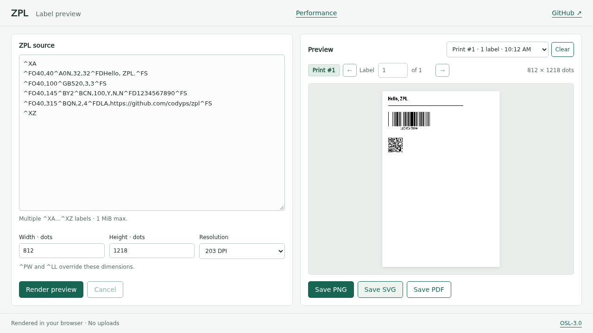

# Browser preview / GitHub Pages

`site/` is a static, framework-free editor. `zpl-wasm/` exposes the existing
renderer through wasm-bindgen without adding browser dependencies to `zpl`.
The wrapper is an internal deployment package (`publish = false`).

ZPL stays in the browser: no rendering API, analytics, persistence, or printer
connection. PNG previews and PNG/SVG/PDF downloads use the native adapters. Multiple
labels are selectable. Save PNG downloads the current label with PNG iTXt metadata:
`Software` identifies the linked `zpl` crate version; `ZPL` contains JSON with the
complete editor source, version, one-based label number, default width/height,
DPI, rendering profile, tab-local print number, and total label count. The full source is retained for multi-label inputs
because earlier commands may affect later labels. Save SVG embeds the same JSON
in a non-rendering `<metadata id="zpl-metadata">` element. PNG pixels and SVG
geometry are unchanged. Save PDF downloads the selected label as a single vector
PDF page sized by its dimensions and DPI; PDF contains the rendered paths without
source metadata. The Rust API and CLI also support multipage PDFs. All save
buttons are disabled until the current preview is ready. The displayed image uses the same PNG blob as
Save PNG, so the browser’s Save Image As action also retains the metadata. Metadata follows
[PNG §11.3.3.4](https://www.w3.org/TR/png-3/#11iTXt) and
[SVG §5.9](https://www.w3.org/TR/SVG2/struct.html#MetadataElement).

Edits retain the displayed image and mark it with an amber border and a
"Preview out of date" badge. Save and label-navigation buttons remain disabled
until a new render is ready or the source and settings exactly match the displayed
render again. Rendering errors and actionable warnings remain visible. The demo omits the general resident-font printer-fidelity caveat
to keep the interface compact.

Rendering runs in a fresh module worker for each request. Cancel, edits, and the
20-second timeout terminate the worker and release its Wasm memory. Input is
limited to 1 MiB and label dimensions to 4096 dots per side, including ZPL
overrides. These limits are resource safeguards, not a guarantee of printer parity.

New prints play a 420 ms paper-feed animation: the previous label slides
down and out as a separate new sheet feeds in above it with a visible gap.
The full green canvas clips the moving sheets; each sheet retains its proportions.
History and label navigation switch without animation.
Reduced-motion preferences skip it. One previous PNG is retained for the animation
in addition to the bounded history. Multi-label submissions feed through all labels
in order, under one shared Print number. The counter and previous/next controls
identify each label in the print; selecting a label or cancelling stops automatic
feeding. Downloads include the print and label numbers in their filenames; PNG and SVG
also include them in metadata. Every click on Render preview starts a new print, even for identical ZPL.

History has one entry per print and restores its ZPL, settings and last viewed
label. Labels already rendered are restored byte-for-byte without rerendering;
labels not yet rendered can be requested with the navigation controls. Each label
uses a fresh bounded worker, with a 20-second limit per label. Successful labels
from an interrupted or partially failed print remain available in its history.
History is memory-only and isolated to this page in this tab: reload or close
clears it. It retains at most 20 prints and 64 MiB of source/image data, evicting
whole older prints first. A larger print remains viewable and downloadable but
is not retained; only its current label is cached. Clear stops automatic feeding
and releases history while leaving the current editor and preview available.
Restoring history cancels an active render.



## Local build

Install Rust, Node.js 22 or later, and the matching bindings CLI:

```sh
rustup target add wasm32-unknown-unknown
cargo install wasm-bindgen-cli --version 0.2.128 --locked
cargo test -p zpl-wasm
bash scripts/build-site.sh
node --test site/tests/wasm.test.mjs
cd site
npm ci
npx playwright install chromium
npm test
cd ..
python3 -m http.server 8080 --directory _site
```

Open `http://localhost:8080/`. Serve over HTTP, not `file://`. All asset URLs are
relative, so the same output works under GitHub Pages' `/zpl/` project path.
Generated output in `_site/` is ignored by Git.

## Deployment

In repository **Settings → Pages → Build and deployment**, select **GitHub
Actions**. Merge the workflow into `main`; **Preview website** builds and tests
on pull requests, and deploys on pushes to `main` or manual runs on `main`.
The intended project URL is `https://codyps.github.io/zpl/` (unless a custom
domain is configured). The build job has read-only repository permissions;
only the deployment job has Pages and OIDC write permissions.

Only `_site/` is uploaded, never repository PDFs, capture campaigns, databases,
or other private files. The repository is currently private: Pages availability
depends on the account plan, and publishing the website does not make repository
source links publicly readable. No repository visibility change is made by this
workflow.

## References

- [wasm-bindgen deployment (web ES modules)](https://wasm-bindgen.github.io/wasm-bindgen/reference/deployment.html)
- [Module workers and worker termination](https://developer.mozilla.org/en-US/docs/Web/API/Web_Workers_API/Using_web_workers)
- [Blob URL lifetime](https://developer.mozilla.org/en-US/docs/Web/API/URL/revokeObjectURL_static)
- [GitHub Pages custom workflows](https://docs.github.com/en/pages/getting-started-with-github-pages/using-custom-workflows-with-github-pages)

Errors replace the preview with a torn-paper note in the locally bundled Patrick Hand
font (SIL OFL 1.1; `site/fonts/OFL.txt`). The note feeds in briefly, skips motion
when requested, and retains a screen-reader status announcement. Successful renders
clear the status text instead of repeating the print and label counters.

## Performance history

The native rendering [performance dashboard](https://codyps.github.io/zpl/perf/)
lives at the separate `/zpl/perf/` path; the label preview remains at `/zpl/`.
The Pages workflow assembles both into a single artifact and also rebuilds after
successful main benchmark publication. This prevents either page from replacing
the other. See [benchmark protocol and local checks](../benchmarks/README.md).
